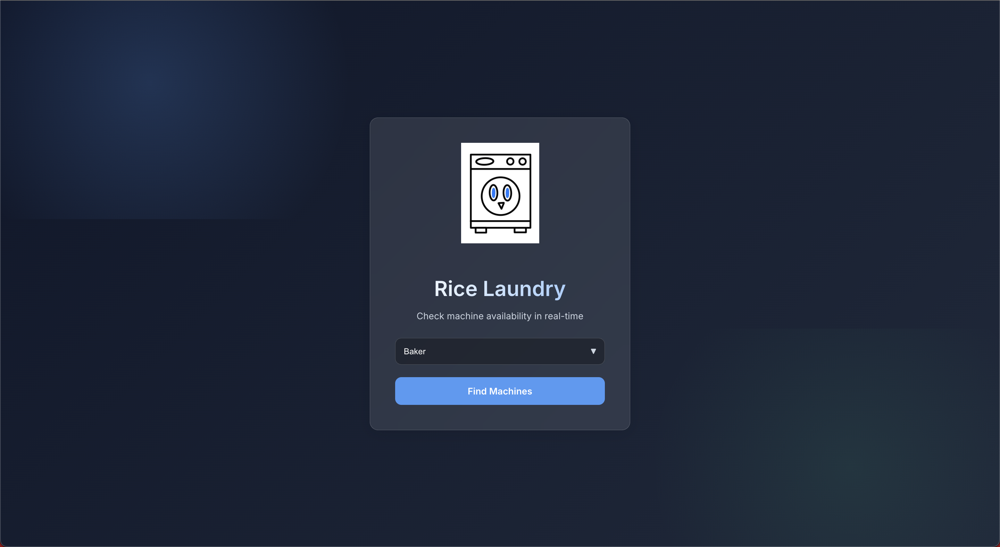
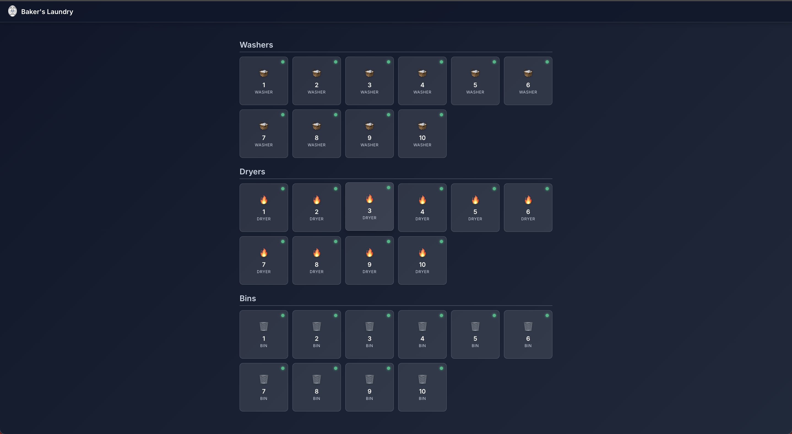

# Rice Laundry 🧺

A modern, full-stack laundry management system designed for Rice University residential colleges. This application allows students to track machine availability in real-time, manage laundry cycles, and report maintenance issues built for HackRice 13.

## 📸 ScreenShots



## 🚀 Features

### Core Functionality
- **Real-Time Availability**: View live status of washers, dryers, and bins for every residential college.
- **Interactive Lifecycle**:
  - **Start Load**: Mark available machines as "In Use".
  - **Move Laundry**: Seamlessly transfer clothes from Washer → Dryer → Bin.
  - **Empty Bin**: clear bins when laundry is retrieved.
- **Issue Reporting**: Flag broken machines and report them as fixed when repaired.

### Advanced Tech
- **🔥 Firebase Integration**: Full persistence using Cloud Firestore.
- **✨ Glassmorphism UI**: Modern, responsive design system inspired by Rice University colors.
- **🔄 Robust State Management**: Includes an automatic "Smart Seeder" that populates 30+ machines per college and a local fallback store for offline reliability.

## 🛠️ Tech Stack

- **Frontend**: React.js, React Router
- **Backend/Database**: Firebase (Firestore)
- **Styling**: Vanilla CSS3 (Variables, Flexbox/Grid, Animations)

## 📦 Installation

1.  **Clone the repository**
    ```bash
    git clone https://github.com/shivam-dalmia/rice-laundry.git
    cd rice-laundry/laundry
    ```

2.  **Install Dependencies**
    ```bash
    npm install
    ```

3.  **Run the App**
    ```bash
    npm start
    ```
    Open [http://localhost:3000](http://localhost:3000) in your browser.

## 💡 How It Works (Demo Mode)

Since this is a portfolio showcase, the app includes a **Smart Seeder**:
1.  Navigate to any college (e.g., Select "Baker" on the home page).
2.  If the database is empty, the app will **automatically generate** 10 Washers, 10 Dryers, and 10 Bins.
3.  Interact with the machines! Your changes are persisted to the database.

---